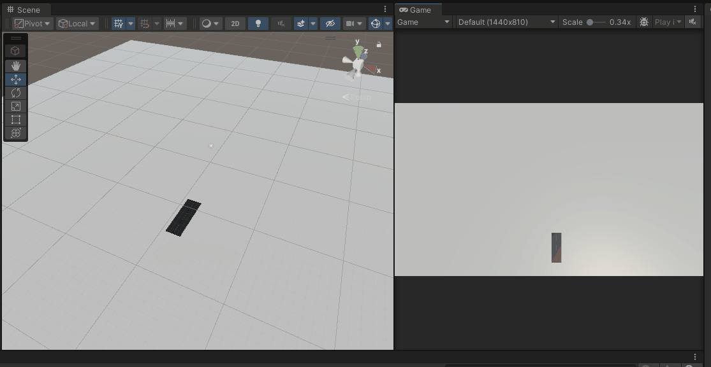

# spline mesh test

Min project for the problem that the mesh of the splines are not visible on WebGL when the splines are updated in runtime when using Spline.

# Demo

https://unityroom.com/games/spline-mesh-test

## Editor

## WebGL

# requirements

* Unity 2022.2.0f1

# Background of the test project

https://twitter.com/ayousanz/status/1604852785467445248?s=20&t=h5I5oU2qg4TCJ0zPOeLzNg

The problem that the mesh associated with the runtime-generated splines is not visible when the splines are updated on WebGL, as discussed in this thread.
